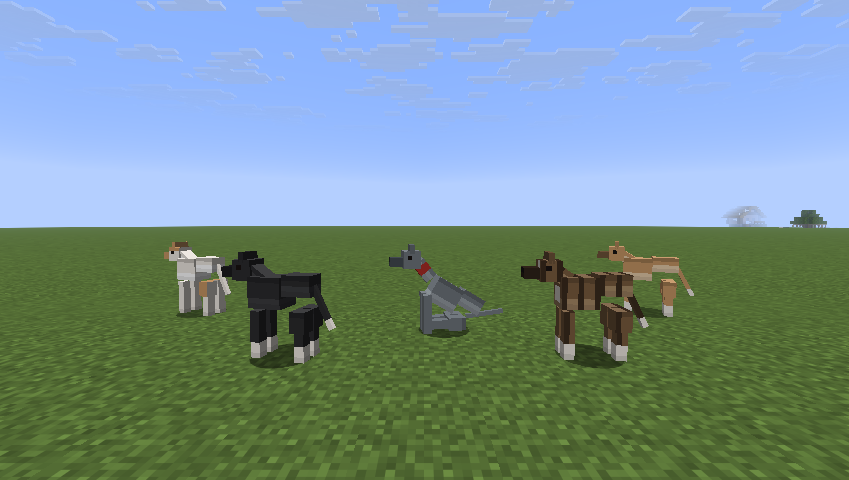

# Whippets

A Fabric mod that adds whippets to Minecraft: tameable sighthounds that are
faster than anything else on four legs, sleep through most of the day, and
periodically detonate into the zoomies.



| | |
|---|---|
| Minecraft | 1.21.11 |
| Loader | Fabric Loader 0.19.5+ |
| Requires | Fabric API 0.141.6+ |
| Java (to play) | 21 |

## What it adds

**The whippet** (`whippets:whippet`) — a tameable animal with five coats that
turn up in the world: fawn, brindle, blue, black and white, the last of which is
deliberately rare. Coats are rolled on spawn, saved per dog, and inherited from
one parent or the other when two whippets breed (with a one-in-ten throwback to
a random coat). A sixth coat belongs to Bonnie and is never rolled at random.

- **Fast.** Movement speed 0.38 against a wolf's 0.3, and it can clear a fence:
  higher jump strength and a longer safe fall distance than other animals.
- **Zoomies.** Every minute or three a whippet explodes into three or four laps
  at roughly twice its normal speed — wide arcs around its owner if it has one —
  kicking up dust as it goes, then flops down where it stopped and refuses to
  move for a few seconds.
- **Sighthound instinct.** Untamed whippets hunt rabbits and chickens on sight.
- **Thin-skinned.** They will not path through powder snow, they avoid water,
  and in cold or wet weather they tuck up and curl their tail under.
- **Quiet.** They borrow the sad wolf's voice, which is mostly sighing.

**Taming and care** — feed a wild whippet any meat from the `#whippets:whippet_food`
tag (rabbit, chicken, mutton or beef, raw or cooked); like a wolf it takes on
average three tries. Tamed whippets sit and follow on right-click, heal when fed,
breed with the same foods, take a collar from any dye, and carry 24 health
(12 hearts) against a wild dog's 14.

**Whippet whistle** — craft from two iron nuggets and a bone. Blowing it stands
every whippet you own within 48 blocks back up, cancels whatever it was doing,
and recalls the distant ones to you. Five-second cooldown.

**Bonnie** — the blue brindle coat is drawn from a real whippet: silver face,
white blaze down the muzzle, white throat and chest, four white feet and a fine
brindle over a warm fawn. No whippet is ever born in it. Call one `Bonnie` with
a name tag and she wears it whatever she was born in, the way a rabbit named
Toast does, and she goes back to her own colours if you rename her.

**Where they live** — plains, sunflower plains, meadows, savanna and savanna
plateau, in ones and twos.

## Installing

Install Fabric Loader for 1.21.11, then drop `whippets-1.0.0.jar` and
[Fabric API](https://modrinth.com/mod/fabric-api) into your `mods/` folder. The
mod works on a client, on a dedicated server, or both — everything it adds is
registered on both sides.

## Building

Loom 1.18 needs Gradle 9.7+ on **JDK 25** to build, even though the mod itself
compiles to Java 21 bytecode and runs on a Java 21 game. The wrapper pins
Gradle, so all you need is a JDK 25:

```sh
JAVA_HOME=/path/to/jdk-25 ./gradlew build     # jar lands in build/libs/
JAVA_HOME=/path/to/jdk-25 ./gradlew runClient # dev client
JAVA_HOME=/path/to/jdk-25 ./gradlew runServer # dev server, world in run/
```

## Layout

```
src/main/java/dev/whippet/whippets/
  Whippets.java          mod entrypoint
  ModEntities.java       entity type, spawn restrictions, default attributes
  ModItems.java          spawn egg + whistle, creative tab entries
  ModWorldGen.java       biome spawn weights
  ModTags.java           the whippet food tag
  entity/WhippetEntity.java   the dog: goals, taming, breeding, coats, tail carriage
  entity/WhippetCoat.java     coat variants and their weights
  entity/ai/ZoomiesGoal.java  run laps, then flop
  item/WhippetWhistleItem.java
src/client/java/dev/whippet/whippets/client/
  WhippetEntityModel.java     the model, and the trot / gallop / sit poses
  WhippetEntityRenderer.java  renderer, render state and the collar layer
src/main/resources/            fabric.mod.json, textures, lang, loot table, tag, recipe
tools/generate_textures.py     draws every PNG in the mod
```

## Art

There are no hand-drawn assets. `tools/generate_textures.py` writes all five
coat sheets, the collar overlay, both item icons and the mod icon from a palette
and a table of cuboid UVs, using nothing but the Python standard library:

```sh
python3 tools/generate_textures.py
```

The `BOXES` table in that script mirrors the cuboids in
`WhippetEntityModel.getModelData()`. If you move a box in the model, move it
there too and re-run, or the coat will land on the wrong face.
