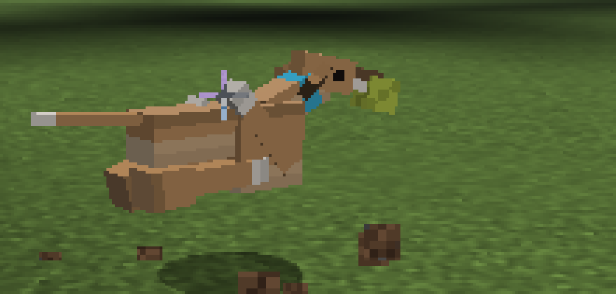
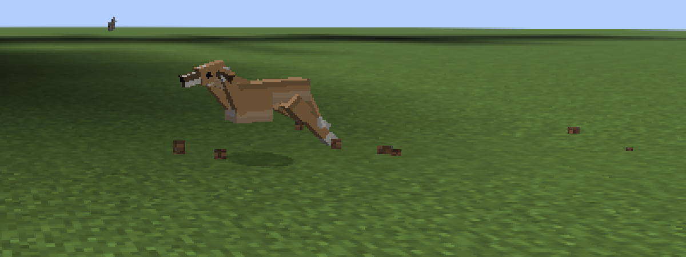
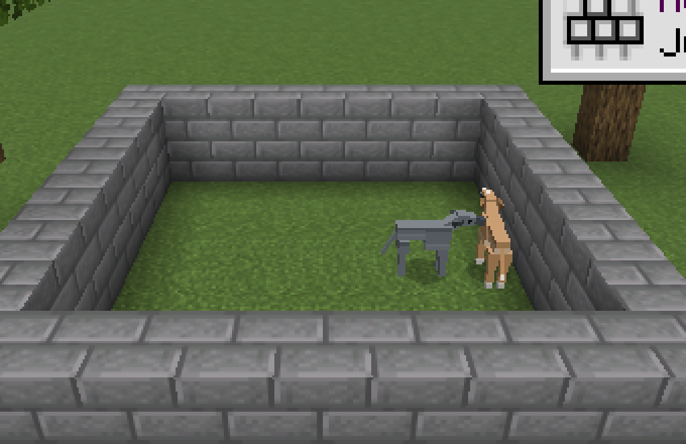
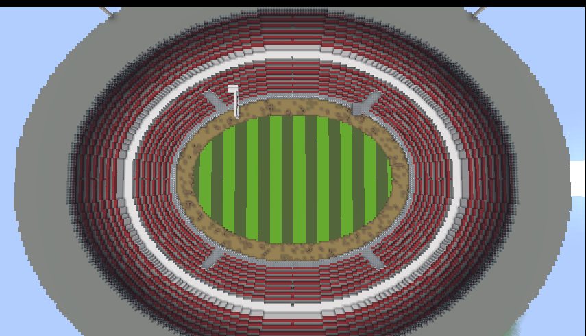
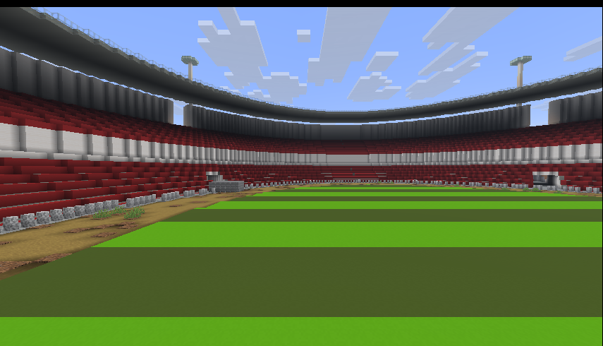
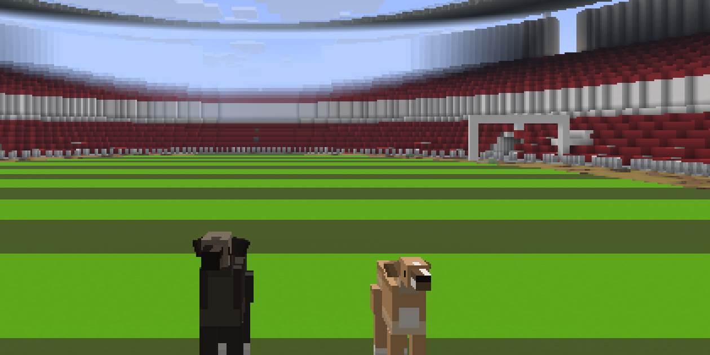
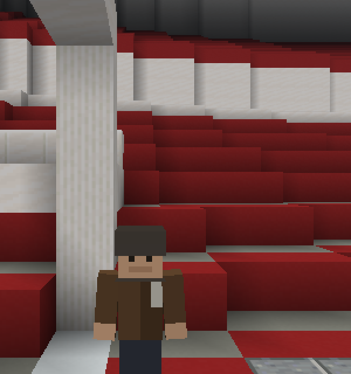

# Whippets

A Fabric mod that adds whippets to Minecraft: tameable sighthounds that are
faster than anything else on four legs, sleep through most of the day, and
periodically detonate into the zoomies.


| | |
|---|---|
| Minecraft | 1.21.11 |
| Loader | Fabric Loader 0.19.5+ |
| Requires | Fabric API 0.141.6+ |
| Java (to play) | 21 |

## Getting started

1. Find one. Whippets turn up in ones and twos in plains, sunflower plains,
   meadows and savanna. A wild one is busy chasing rabbits and will not care
   about you.
2. Tame it. Hold rabbit, chicken, mutton or beef — raw or cooked — and feed it.
   Like a wolf it takes about three goes. Hearts mean yes, smoke means try
   again.
3. Now you have a dog. It follows you, sits and stands on right-click, heals
   when fed, takes a collar from any dye, and breeds with the same foods.
4. Stand still for a couple of seconds and it will come and curl up against
   you. Hold food and it will tilt its head at you and whine until you give in.
5. Wait. Sooner or later it will explode into the zoomies, run several laps
   round you at twice its normal speed, and then flop over.

### Racing them

Craft a **whippet lure** from a stick, string and white wool.

1. Right-click a block with the lure to peg it. That spot is the finish.
2. Walk back up the track to where you want the start — anything up to 128
   blocks — and right-click in the air.
3. Every tamed whippet of yours within 24 blocks is called to the line. They
   teleport into lanes abreast facing the lure and are held through a
   three-count; they cannot creep forward before the bell.
4. On the bell they run flat out. The first to reach the lure wins, takes a lap
   of honour, and everyone near the finish gets the result and the times.

Each dog has its own form — a pace rolled when it was born, worth about ten per
cent either way and passed on to its pups — and its own reaction out of the
traps. Over a short track the break decides it; over a long one the better dog
tells. You find out which of yours is quick by racing them.

### Calling them back

Craft a **whippet whistle** from two iron nuggets and a bone. Blowing it stands
up every whippet you own within 48 blocks, cancels whatever it was doing —
racing, zoomies, hiding under a duvet — and recalls the distant ones to you.

## What it adds

**The whippet** (`whippets:whippet`) — a tameable animal with five coats that
turn up in the world: fawn, brindle, blue, black and white, the last of which is
deliberately rare. Coats are rolled on spawn, saved per dog, and inherited from
one parent or the other when two whippets breed (with a one-in-ten throwback to
a random coat). A sixth coat belongs to Bonnie and is never rolled at random.

- **Fast.** Movement speed 0.38 against a wolf's 0.3, and it can clear a fence:
  higher jump strength and a longer safe fall distance than other animals. And
  then there is turbo, which is below.
- **Three gaits.** Dawdling, it uses the long easy diagonal trot. Pushed on —
  chasing something, coming when it is called — that tightens into the quick
  trot: the cadence roughly doubles, the stride shortens, the feet snap through
  and hold at the ends instead of sweeping, and the whole body rocks from side
  to side and bounces on each diagonal, which is the armadillo's busy scuttle
  done on a sighthound's legs. Zoomies and races get the double-suspension
  gallop. Which one you see is decided by the ground it actually covers each
  tick, so it shifts up and down as the dog does, and a dog with a better pace
  picks its feet up a little quicker.
- **Zoomies.** Every minute or three a whippet explodes into three or four laps
  at roughly twice its normal speed — wide arcs around its owner if it has one —
  kicking up dust as it goes, then flops down where it stopped and refuses to
  move for a few seconds.
- **Sighthound instinct.** Untamed whippets hunt rabbits and chickens on sight.
- **Lurchers.** Bigger than a whippet and faster than one, and the only one in
  the world is Bobby Brazil, who lives at the stadium. See below.
- **Cats.** There is no negotiating with a sighthound about a cat. It is not
  dislike exactly — a cat is the right size, the right shape and the wrong
  speed, and the dog's opinion is settled before it has thought about it. Tame
  or wild, they go. What makes it worse is that they do it together: the first
  one to see a cat honks, and every whippet within sixteen blocks comes in on
  it. A caught cat is eaten, like everything else they catch, and is worth two
  hearts. Ocelots count as cats and are treated exactly as badly.
- **Thin-skinned.** They will not path through powder snow, they avoid water,
  and in cold or wet weather they tuck up and curl their tail under.
- **Not quiet.** A whippet whines, and this one whines about things: at you
  while you hold food, at being told to stay while you walk off, at being left
  on a lead, and at being cold with nowhere to get under. **The whine is Bonnie
  too** — one long drawn-out call from the same afternoon as the honks, which is
  the noise a whippet actually spends most of its waking day making. It doubles
  as the sigh it lets out, once and heavily, the moment it finally settles
  against you: the same call, dropped and quietened. Each dog whines on its own
  note and puppies higher. Only the yelp when something hurts it is still a
  borrowed wolf, and it is staying that way.
- **The snoot.** A whippet's nose is a communication device. A hungry one comes
  and finds you, works its way round behind you where you cannot see it coming,
  and puts its nose against the back of your leg — a cold, deliberate tap — then
  stands there. Ignore it and it will do it again a few seconds later, and keep
  doing it until you feed it. Any of the meat it tames on resets the clock;
  a whippet gets hungry two or three times a Minecraft day.
- **And then it honks.** Whining is only the polite opening. Keep a whippet
  waiting for something it wants — food in your hand it has not been given, a
  squirrel up a tree, you walking off while it has been told to stay — and after
  about two and a half seconds of being ignored it stops asking and starts
  honking at you. Every whippet owner says the same thing about this noise, and
  the mod does not imitate it: **the honk is a real whippet honking.** Bonnie,
  recorded on a phone by her owner, four takes including one double with her own
  gap between the calls. Short, bright and nasal, nothing like the long low
  goose honk that was synthesised in her place first. Each dog honks on its own
  note, derived from its pace, and puppies honk higher. See
  [docs/sound.md](docs/sound.md).



**The ball** — craft one from a slime ball, white wool and yellow dye, and throw
it with a right-click. It is the one thing a whippet will interrupt anything
for: it goes after it flat out, catches up with it, picks it up, and carries it
in its mouth, where you can see it.

Then it mostly brings it back. Mostly. One throw in four the dog decides that
this is now its ball, takes it off across the field and keeps it over there for
six seconds before any question of giving it back arises — which is not a bug
and is not going to be fixed. A ball lying at your feet is not interesting; it
has to have been thrown. A dog carrying one drops it if it dies, so you never
lose it for good.



**Flat out** — a whippet has one trick nothing else in the overworld can answer,
and this is it. Given a reason, it drops into the gallop and goes at thirteen
blocks a second: twice a sprinting player, a shade over the fastest horse, and
two and a half times what the same dog does chasing something at its ordinary
pace. It winds up over about half a second rather than arriving at speed, it
throws the ground up behind it, and at full stretch it runs by sight — straight
at the thing, rather than round the corners of a path, which is what a
sighthound is for.

What it has not got is any depth. There is about six seconds of that in a
whippet, and a dog that empties the tank is **blown**: head down, tail down,
panting, and slower than its own walking pace until it has most of its breath
back. It goes flat out on its own when there is a reason — quarry more than six
blocks off that has to be run down, or you breaking into a sprint, which a
whippet is physically unable to ignore — and you can also just ask:

- **Crouch and right-click your own whippet with an empty hand** and it is
  *slipped*, which is the racing word for letting one go. If it has nothing in
  particular to chase it invents something and runs a lap of the field.
- **Crouch and blow the whistle** and the whole pack is slipped at once. Blowing
  it standing up still recalls them, as it always did.

A slip is five seconds, which will not empty a full tank, so asking a dog to run
does not wreck it — a long chase will. Puppies have a third of the tank and no
judgement at all about spending it.



**Saying hello** — two whippets who meet go nose to nose. They do not circle and
posture the way other dogs do: they walk straight up to each other, touch noses
once, and get on with whatever they were doing. It lasts a second, and then they
leave each other alone for a good while.

**Taming and care** — feed a wild whippet any meat from the `#whippets:whippet_food`
tag (rabbit, chicken, mutton or beef, raw or cooked); like a wolf it takes on
average three tries. Tamed whippets sit and follow on right-click, heal when fed,
breed with the same foods, take a collar from any dye, and carry 24 health
(12 hearts) against a wild dog's 14.

**Whippet whistle** — craft from two iron nuggets and a bone. Blowing it stands
every whippet you own within 48 blocks back up, cancels whatever it was doing,
and recalls the distant ones to you. Five-second cooldown.

**Bonnie** — the blue brindle coat is drawn from a real whippet: silver face,
white blaze down the muzzle, white throat and chest, four white feet and a fine
brindle over a warm fawn. No whippet is ever born in it. Call one `Bonnie` with
a name tag and she wears it whatever she was born in, the way a rabbit named
Toast does, and she goes back to her own colours if you rename her.

**Begging** — hold anything from the food tag and every whippet in earshot
comes and stands in front of you with its head tilted over, whining at intervals
until you either feed it or put the food away. The head tilt is the point.

**Comfort** — whippets are heat-seeking. Sit still, sneak or go to sleep
anywhere near one of yours and it will come over, press itself against you and
curl up, with the odd heart to say so, and it stays there until you move. While
it is curled against you it thaws you out: your freezing ticks come off four
times as fast, so a whippet on your lap is powder-snow insurance.


**Under the covers** — at night, in rain or snow, or in a cold biome, a whippet
goes looking for bedding: a bed within ten blocks, or failing that any wool or
carpet. It climbs in, disappears under the covers and leaves a lump and a paw
showing, healing slowly while it is in there, and it stops shivering as soon as
it is tucked up. Three house rules, all of them from life:

- **One dog to a bed.** They do not share, and a whippet that finds another one
  already in there goes and finds its own. Two of them setting off for the same
  bed is handled as well — the first to want it has it.
- **It does not care that you are in it.** If you are asleep in that bed you are
  woken up and turned out, and it gets in. So is anybody else who was asleep in
  it, villagers included.
- **A minute at the outside.** It never stays long: up to sixty seconds, and
  then it is suddenly and urgently somewhere else, out of the bed in one
  movement and away, for reasons it does not explain. It will not go back for
  half a minute or so.

Blow the whistle if you want it out sooner.

**Racing** — craft a lure from a stick, string and white wool. Right-click a
block with it to peg the lure: that spot is the finish, and the lure drops to
the ground under wherever you pegged it, so it is always standing on something
the dogs can run to. Then stand where you
want the start and right-click in the air. Every tamed whippet of yours within
24 blocks is called to the line, teleported into lanes abreast facing the lure,
and held there through a three-count — they cannot creep forward before the
bell. On the bell they are released and settle into a strong cruise, and then
each dog picks its own point to make its run and goes flat out for the line. The
first to reach the lure wins and takes its lap of honour, and everyone near the
finish gets the result and the times.

Where a dog makes its run is rolled per race, anywhere from a quarter to three
quarters of the way out, and there is only six seconds of flat out in any of
them — so a dog that goes early can lead a long way and still come home blown
with the field going past it. Over sixty blocks a middling race looks like four
seconds of cruising and two and a half of sprint.

Every whippet has its own **form**: a pace rolled when it is born, worth about
ten per cent either way, passed to its pups with a little drift. It also breaks
from the traps at its own speed, and a slow break costs about half a second. On
a short track the break decides the race; on a long one the better dog tells,
which is the whole argument for running them over a proper distance. A pegged
lure is remembered for the session, so peg it again after a restart.



**The stadium** — and then there is the big one. Somewhere out in open country
there is a proper stadium, modelled on the Emirates and built to something like
its size: two hundred blocks by a hundred and sixty of oval bowl, a hundred and
twenty by eighty-four of racing track inside it, two tiers of red seating raked
one in two the whole way round with a concourse between them, four tunnels in
through the stand, a quartz facade with arched openings, a roof ring over the
back of the stand and four floodlight masts. Six traps on the home straight, a
finish line under a gantry, and a pitch mown in stripes.

It is rare, it needs a couple of hundred blocks of nearly level ground, and it
will not generate on top of a village. Being a proper structure rather than a
scattered feature, you can also ask the game where the nearest one is:

```
/locate structure whippets:stadium
```





**Bobby Brazil** — the dog at the top of the card. He is a lurcher rather than a
whippet: a head taller, heavier, and carrying a pace of 1.28 when the best
whippet ever born rolls about 1.10. He is drawn from a real lurcher — near
black with a warm cast, a tan muzzle going grey, a white chin and chest and
white toes on every foot — and he lives on the pitch. He is not tameable, he is
not for sale, and he does not leave the ground.

He is beatable. He is not easily beatable: over the stadium's home straight a
field of ordinary good whippets takes him about two times in five, and he does
not miss his break the way your dogs will.



**The Guv'nor** — the man who runs the place, and the only one who can put a
meeting on. Bring your tamed whippets inside the ground and right-click him:
he pegs the lure at the finish, enters Bobby against you, calls the field to
the traps and starts the card. Then he settles up.

- Win an ordinary race here and he pays three emeralds.
- **Beat Bobby Brazil** and it is twelve emeralds and the **Racing Trophy**,
  which has no recipe and is the only way to get one.
- Beat nothing and he will tell you Bobby is a good dog, mind.


**The little track** — the village end of the sport, and much more common than
the stadium: a track out in open country in plains, sunflower plains, meadow,
savanna and savanna plateau, one somewhere in every hundred and forty chunks of
it. Thirty-six blocks of run between two fenced rails with lanterns on the
posts, four traps at one end, a lure on a gantry over the finish line, a stone
stand down one side to shout from, and a clubhouse with a campfire, hay bales
and a chest with the club's gear in it: a lure, a whistle, a ball, a lead, some
bones and a couple of rabbits. `/locate structure whippets:whippet_track` will
find you the nearest one.

There are whippets living on it. Two or three of them, and they do not wander
off, and nobody knows whose they are.

It levels its own ground, so it always comes out flat enough to run a race on,
and it lays its running surface as path rather than dirt, which is why the grass
that comes up everywhere else afterwards stops dead at the rails. Peg your own
lure at the finish, stand at the traps and call them up.

**Where they live** — plains, sunflower plains, meadows, savanna and savanna
plateau, in ones and twos.


**The squirrel** (`whippets:squirrel`) — small, quick and entirely aware that it
is faster up a tree than anything chasing it. Three kinds turn up: red, grey and
a rare black one, which is a melanistic grey and does happen. They live in
forest, birch forest, dark forest, taiga, old-growth pine and spruce taiga,
wooded badlands and groves, in twos and threes.

- **Sitting up.** Leave one alone for three seconds and it goes up on its
  haunches with both front paws at its mouth and its tail plumed up its back.
  This is what squirrels do and it is the reason they are in the mod.
- **Thieving.** Drop seeds, berries, an apple or cocoa beans anywhere near one
  and it will come and take them, carry the prize six blocks off with its cheeks
  full, dig, bury it, and pat the ground down over it. It will not remember
  where.
- **Cheek.** It will take a seed out of your hand from eight blocks away and
  only then remember that it is supposed to be frightened of you. Walk at one
  and it goes — but not far.
- **Breeding.** The same seeds, and kits are half-size with the full-size cheek.


**The chase** — this is the part the mod is for. Tame or wild, a whippet that
sees a squirrel on the ground goes after it, and a sighthound over open grass
will catch one. The squirrel's answer is the nearest trunk: it breaks for a tree
— one that is not on the dog's side of it — takes hold of the bark and goes
straight up, five blocks in about a second, and hangs there. Once it is more
than a couple of blocks above the dog the chase is over and the whippet knows
it: it loses the target, plants itself at the bottom of the tree, throws its
head back and whines up at the branches for twenty seconds before it can be
persuaded to give up.

The squirrel, meanwhile, turns round and tells the dog exactly what it thinks of
it — chattering at it, tail thrashing — for as long as the dog is down there.
A whippet that does catch one eats it on the spot and is two hearts better off.

## Installing

1. Install [Fabric Loader](https://fabricmc.net/use/installer/) 0.19.5 or newer
   for Minecraft 1.21.11, and make sure you have Java 21 to play on.
2. Put [Fabric API](https://modrinth.com/mod/fabric-api) (0.141.6+1.21.11 or
   newer) in your `mods/` folder.
3. Put `whippets-1.0.0.jar` in beside it.

The mod works on a client, on a dedicated server, or both — everything it adds
is registered on both sides. For multiplayer, the jar has to be on the server
and on every client.

### Where to get the jar

Either build it (below), or let CI do it: `.github/workflows/build.yml` builds
the mod, boots a dedicated server with it to check the jar actually loads, and
uploads the result.

- **A release:** push a tag — `git tag v1.0.0 && git push origin v1.0.0` — and
  the jar is attached to a GitHub release.
- **A one-off build:** Actions → "Build" → Run workflow. The jar lands on the
  run's summary page as an artifact.

## Building

Loom 1.18 needs Gradle 9.7+ on **JDK 25** to build, even though the mod itself
compiles to Java 21 bytecode and runs on a Java 21 game. The wrapper pins
Gradle, so all you need is a JDK 25:

```sh
JAVA_HOME=/path/to/jdk-25 ./gradlew build     # jar lands in build/libs/
JAVA_HOME=/path/to/jdk-25 ./gradlew runClient # dev client
JAVA_HOME=/path/to/jdk-25 ./gradlew runServer # dev server, world in run/
```

## Layout

```
.github/workflows/build.yml    CI: build, boot a server with the jar, release on a tag
tools/generate_textures.py     draws every PNG in the mod
src/main/java/dev/whippet/whippets/
  Whippets.java          mod entrypoint
  ModEntities.java       entity type, spawn restrictions, default attributes
  ModItems.java          spawn egg + whistle, creative tab entries
  ModWorldGen.java       biome spawn weights
  ModTags.java           the whippet food tag
  entity/WhippetEntity.java   the dog: goals, taming, breeding, coats, tail carriage
  entity/SquirrelEntity.java  the squirrel: variants, sitting up, holding on to bark
  entity/WhippetCoat.java     coat variants and their weights
  entity/ai/ZoomiesGoal.java  run laps, then flop
  entity/ai/RaceGoal.java     hold in the traps, then run at the lure
  entity/ai/CuddleGoal.java   come over and lean on a settled owner
  entity/ai/BegGoal.java      head-tilt, whine and eventually honk at anyone holding food
  entity/ai/BurrowGoal.java   find bedding and disappear under it
  entity/ai/SnootGoal.java    hungry: get behind them and tap the back of the leg
  entity/ai/GreetGoal.java    nose to nose with another whippet
  entity/ai/BarkUpTheTreeGoal.java     stand under the tree and complain
  entity/ai/FetchGoal.java    go after the ball, and mostly bring it back
  entity/ai/HuntCatsGoal.java  see a cat, tell the others, go
  entity/GuvnorEntity.java    the man who runs the stadium, and the purse
  world/TrackStructure.java   whether this ground will take a little track
  world/TrackPiece.java       the little track itself, one chunk at a time
  world/StadiumStructure.java  whether this ground will take a stadium
  world/StadiumPiece.java     the stadium itself, one chunk at a time
  entity/ai/SquirrelFleeWhippetGoal.java  break for a trunk and go up it
  entity/ai/SquirrelTauntGoal.java     chatter at the dog from out of reach
  entity/ai/SquirrelStashGoal.java     steal it, carry it off, bury it
  race/RaceManager.java       pegged lures and the races in progress
  race/WhippetRace.java       line-up, countdown, finish times, results
  item/WhippetWhistleItem.java
  item/WhippetLureItem.java
  item/WhippetBallItem.java
src/client/java/dev/whippet/whippets/client/
  WhippetEntityModel.java     the model, the trot / gallop / flat-out / sit / curl poses, the head tilt
  SquirrelEntityModel.java    the squirrel, its tail, and the bound / sit-up / climb poses
  WhippetEntityRenderer.java  renderer, render state and the collar layer
  WhippetBallFeatureRenderer.java  the ball, in the mouth, where the dog put it
src/main/resources/            fabric.mod.json, textures, lang, loot table, tag, recipe
```

## Art

There are no hand-drawn assets. `tools/generate_textures.py` writes all six coat
sheets, the collar overlay, the three item icons and the mod icon from a palette
and a table of cuboid UVs, using nothing but the Python standard library:

```sh
python3 tools/generate_textures.py
```

The `WHIPPET_BOXES` and `SQUIRREL_BOXES` tables in that script mirror the
cuboids in `WhippetEntityModel.getModelData()` and `SquirrelEntityModel`. If you move a box in a model, move it
there too and re-run, or the coat will land on the wrong face.

The shape itself is drawn from photographs of a real whippet rather than from
the wolf it started as: a long narrow wedge of a head with barely any stop,
rose ears folded back along the skull, a long neck carried high, a deep chest
and a hard tuck-up, hindquarters set back under the arch, and a low whip tail.
The proportions are held to life size — withers sixteen units, head seven,
brisket level with the elbow — so a coat change never quietly deforms the dog.

The speeds are measured rather than guessed. A whippet chasing something at its
ordinary pace covers 0.27 blocks a tick; flat out it holds 0.65, which is 13
blocks a second. Getting there took finding out how the game actually moves an
animal: the move control turns its speed figure into an acceleration of (speed ×
the movement attribute) squared, which the ground's drag then settles into a
terminal speed — so `WhippetEntity` derives the figure it hands the control from
the speed it wants, and clamps the velocity as well for ice and soul sand. The
same measurements said the pathfinder was the real limit: a dog at this speed
overruns every corner of a block path and arrives having zig-zagged, covering
less ground than a slower one. Hence running by sight, in `mobTick`, which
overrides the path with a straight line at the quarry whenever the next stride
and a half is clear, and hands the steering back the moment it is not.

Both tracks are built the same way as everything else here — in code, from a
table of block positions, with no saved structure file — and both level and foot
their own site, so they can be dropped on gently rolling ground without ending up
on stilts.

Both are also **structures** rather than features, and for the stadium that is
the whole reason it can be that big. A feature may only write to the chunk it
was called for and the ring of chunks around it: anything further off is thrown
away, with an error in the log and a hole in the build. The little track was a
feature until 2.0.0, and at forty-three blocks laid from a random spot inside a
chunk it regularly ran off the end of what it was allowed to write, which is
why tracks were turning up short of their traps or their finish. A structure is
handed its site one chunk at a time and clips each pass to that chunk, so the
track comes out whole wherever the seams fall and the stadium goes down over a
hundred and forty chunks without one. Everything about the bowl is
worked out from one ellipse — the track's outer edge — and a local scale factor
that converts a distance measured outwards from it into blocks, so the seating,
the concourse, the facade and the tunnels all come out the same width on the
bends as they are on the straights, rather than pinching round the ends. The
pitch is concrete rather than turf on purpose: the world plants its trees after
the structures go down, and a grass infield comes up with an oak wood in the
middle of it.

Racing needed three fixes to work on ground that is not a billiard table. A
lure pegged on a ledge used to hang in the air where no dog could reach it, so
the race could never end and the field milled about underneath it — it now
drops to the ground, and the finish is measured flat with a generous allowance
for height. Dogs ran to the lure along a block path, which at racing speed they
overshot, so they now run at it by sight (the same machinery turbo uses) with
the path as the fallback for when something is in the way. And a dog that is
genuinely stuck — at the foot of a bank with no way round — now retires from
the race after eight seconds rather than holding up the result.

Her voice is the exception to all of this: the honk and the whine are recordings
of Bonnie, not generated at all, and her owner has put them out under the same
MIT licence as the code — so they are yours to use like the rest of it. How they
were cleaned and cut is in [docs/sound.md](docs/sound.md).
`tools/generate_sounds.py` still synthesises one from a pitch contour, thirty
harmonics and four nasal formants — that is what shipped before there was a
recording — but it writes to `tools/synthesised-honks/` now and nothing uses it.

The banner is Bonnie herself, coarsened into the game's idiom:
`tools/banner/Pixelate.java` downsamples her photograph to a 160-square grid
and flattens the palette with k-means, and `tools/banner/Banner.java` sets the
result beside the title with the pixels kept square. See `tools/banner/` for
the commands. The photograph itself is not in the repository.

## Licence

MIT — see `LICENSE`. Use it, change it, put it in your own pack; keep the
copyright notice with it.

Minecraft, Fabric Loader and Fabric API come under their own terms from their
own authors, and this mod is not affiliated with or endorsed by Mojang or
Microsoft.
