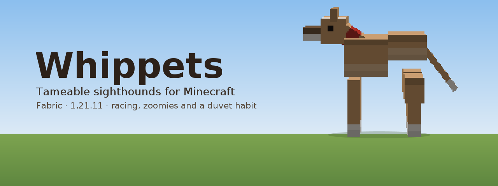
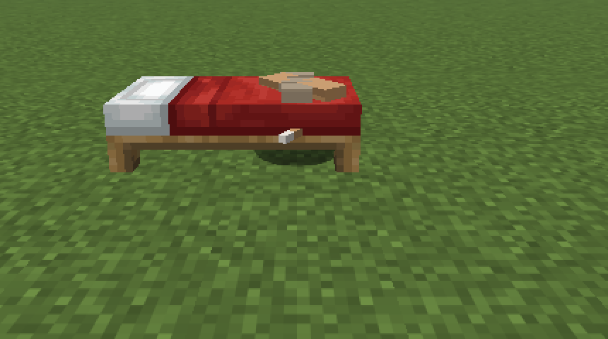
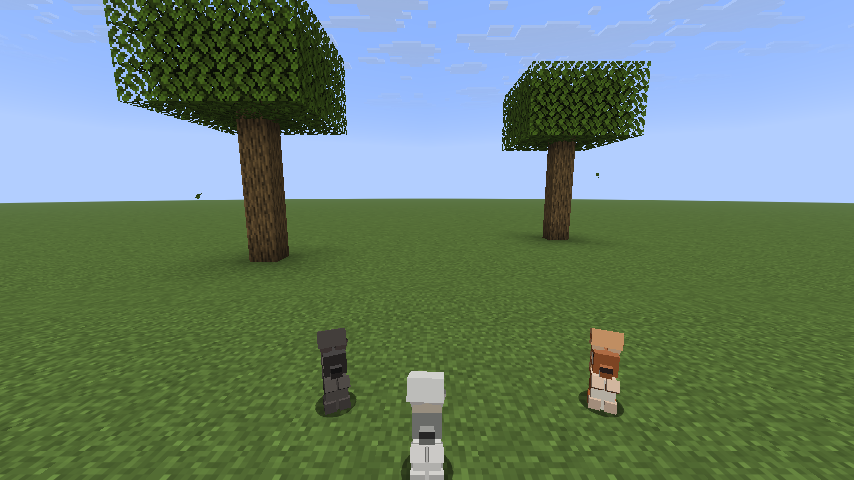
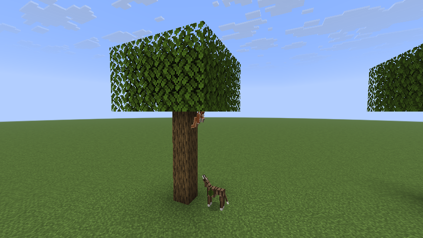

# Whippets

A Fabric mod that adds whippets to Minecraft: tameable sighthounds that are
faster than anything else on four legs, sleep through most of the day, and
periodically detonate into the zoomies.


| | |
|---|---|
| Minecraft | 1.21.11 |
| Loader | Fabric Loader 0.19.5+ |
| Requires | Fabric API 0.141.6+ |
| Java (to play) | 21 |

## Getting started

1. Find one. Whippets turn up in ones and twos in plains, sunflower plains,
   meadows and savanna. A wild one is busy chasing rabbits and will not care
   about you.
2. Tame it. Hold rabbit, chicken, mutton or beef — raw or cooked — and feed it.
   Like a wolf it takes about three goes. Hearts mean yes, smoke means try
   again.
3. Now you have a dog. It follows you, sits and stands on right-click, heals
   when fed, takes a collar from any dye, and breeds with the same foods.
4. Stand still for a couple of seconds and it will come and curl up against
   you. Hold food and it will tilt its head at you and whine until you give in.
5. Wait. Sooner or later it will explode into the zoomies, run several laps
   round you at twice its normal speed, and then flop over.

### Racing them

Craft a **whippet lure** from a stick, string and white wool.

1. Right-click a block with the lure to peg it. That spot is the finish.
2. Walk back up the track to where you want the start — anything up to 128
   blocks — and right-click in the air.
3. Every tamed whippet of yours within 24 blocks is called to the line. They
   teleport into lanes abreast facing the lure and are held through a
   three-count; they cannot creep forward before the bell.
4. On the bell they run flat out. The first to reach the lure wins, takes a lap
   of honour, and everyone near the finish gets the result and the times.

Each dog has its own form — a pace rolled when it was born, worth about ten per
cent either way and passed on to its pups — and its own reaction out of the
traps. Over a short track the break decides it; over a long one the better dog
tells. You find out which of yours is quick by racing them.

### Calling them back

Craft a **whippet whistle** from two iron nuggets and a bone. Blowing it stands
up every whippet you own within 48 blocks, cancels whatever it was doing —
racing, zoomies, hiding under a duvet — and recalls the distant ones to you.

## What it adds

**The whippet** (`whippets:whippet`) — a tameable animal with five coats that
turn up in the world: fawn, brindle, blue, black and white, the last of which is
deliberately rare. Coats are rolled on spawn, saved per dog, and inherited from
one parent or the other when two whippets breed (with a one-in-ten throwback to
a random coat). A sixth coat belongs to Bonnie and is never rolled at random.

- **Fast.** Movement speed 0.38 against a wolf's 0.3, and it can clear a fence:
  higher jump strength and a longer safe fall distance than other animals.
- **Three gaits.** Dawdling, it uses the long easy diagonal trot. Pushed on —
  chasing something, coming when it is called — that tightens into the quick
  trot: the cadence roughly doubles, the stride shortens, the feet snap through
  and hold at the ends instead of sweeping, and the whole body rocks from side
  to side and bounces on each diagonal, which is the armadillo's busy scuttle
  done on a sighthound's legs. Zoomies and races get the double-suspension
  gallop. Which one you see is decided by the ground it actually covers each
  tick, so it shifts up and down as the dog does, and a dog with a better pace
  picks its feet up a little quicker.
- **Zoomies.** Every minute or three a whippet explodes into three or four laps
  at roughly twice its normal speed — wide arcs around its owner if it has one —
  kicking up dust as it goes, then flops down where it stopped and refuses to
  move for a few seconds.
- **Sighthound instinct.** Untamed whippets hunt rabbits and chickens on sight.
- **Thin-skinned.** They will not path through powder snow, they avoid water,
  and in cold or wet weather they tuck up and curl their tail under.
- **Not quiet.** A whippet whines, and this one whines about things: at you
  while you hold food, at being told to stay while you walk off, at being left
  on a lead, and at being cold with nowhere to get under. It sighs, once and
  heavily, the moment it finally settles against you. It has the small dog's
  panting and muttering and the sad dog's whine, pitched up because it is a
  narrow little animal — puppies higher still.

**Taming and care** — feed a wild whippet any meat from the `#whippets:whippet_food`
tag (rabbit, chicken, mutton or beef, raw or cooked); like a wolf it takes on
average three tries. Tamed whippets sit and follow on right-click, heal when fed,
breed with the same foods, take a collar from any dye, and carry 24 health
(12 hearts) against a wild dog's 14.

**Whippet whistle** — craft from two iron nuggets and a bone. Blowing it stands
every whippet you own within 48 blocks back up, cancels whatever it was doing,
and recalls the distant ones to you. Five-second cooldown.

**Bonnie** — the blue brindle coat is drawn from a real whippet: silver face,
white blaze down the muzzle, white throat and chest, four white feet and a fine
brindle over a warm fawn. No whippet is ever born in it. Call one `Bonnie` with
a name tag and she wears it whatever she was born in, the way a rabbit named
Toast does, and she goes back to her own colours if you rename her.

**Begging** — hold anything from the food tag and every whippet in earshot
comes and stands in front of you with its head tilted over, whining at intervals
until you either feed it or put the food away. The head tilt is the point.

**Comfort** — whippets are heat-seeking. Sit still, sneak or go to sleep
anywhere near one of yours and it will come over, press itself against you and
curl up, with the odd heart to say so, and it stays there until you move. While
it is curled against you it thaws you out: your freezing ticks come off four
times as fast, so a whippet on your lap is powder-snow insurance.



**Under the covers** — at night, in rain or snow, or in a cold biome, a whippet
goes looking for bedding: a bed within ten blocks, or failing that any wool or
carpet. It climbs in, disappears under the covers and leaves a lump and a paw
showing. It stays until it has warmed through, and all night if it is night,
healing slowly while it is in there, and it stops shivering as soon as it is
tucked up. Blow the whistle if you want it out.

**Racing** — craft a lure from a stick, string and white wool. Right-click a
block with it to peg the lure: that spot is the finish. Then stand where you
want the start and right-click in the air. Every tamed whippet of yours within
24 blocks is called to the line, teleported into lanes abreast facing the lure,
and held there through a three-count — they cannot creep forward before the
bell. On the bell they are released and run flat out at the lure; the first to
reach it wins and takes its lap of honour, and everyone near the finish gets the
result and the times.

Every whippet has its own **form**: a pace rolled when it is born, worth about
ten per cent either way, passed to its pups with a little drift. It also breaks
from the traps at its own speed, and a slow break costs about half a second. On
a short track the break decides the race; on a long one the better dog tells,
which is the whole argument for running them over a proper distance. A pegged
lure is remembered for the session, so peg it again after a restart.

**Where they live** — plains, sunflower plains, meadows, savanna and savanna
plateau, in ones and twos.



**The squirrel** (`whippets:squirrel`) — small, quick and entirely aware that it
is faster up a tree than anything chasing it. Three kinds turn up: red, grey and
a rare black one, which is a melanistic grey and does happen. They live in
forest, birch forest, dark forest, taiga, old-growth pine and spruce taiga,
wooded badlands and groves, in twos and threes.

- **Sitting up.** Leave one alone for three seconds and it goes up on its
  haunches with both front paws at its mouth and its tail plumed up its back.
  This is what squirrels do and it is the reason they are in the mod.
- **Thieving.** Drop seeds, berries, an apple or cocoa beans anywhere near one
  and it will come and take them, carry the prize six blocks off with its cheeks
  full, dig, bury it, and pat the ground down over it. It will not remember
  where.
- **Cheek.** It will take a seed out of your hand from eight blocks away and
  only then remember that it is supposed to be frightened of you. Walk at one
  and it goes — but not far.
- **Breeding.** The same seeds, and kits are half-size with the full-size cheek.



**The chase** — this is the part the mod is for. Tame or wild, a whippet that
sees a squirrel on the ground goes after it, and a sighthound over open grass
will catch one. The squirrel's answer is the nearest trunk: it breaks for a tree
— one that is not on the dog's side of it — takes hold of the bark and goes
straight up, five blocks in about a second, and hangs there. Once it is more
than a couple of blocks above the dog the chase is over and the whippet knows
it: it loses the target, plants itself at the bottom of the tree, throws its
head back and whines up at the branches for twenty seconds before it can be
persuaded to give up.

The squirrel, meanwhile, turns round and tells the dog exactly what it thinks of
it — chattering at it, tail thrashing — for as long as the dog is down there.
A whippet that does catch one eats it on the spot and is two hearts better off.

## Installing

1. Install [Fabric Loader](https://fabricmc.net/use/installer/) 0.19.5 or newer
   for Minecraft 1.21.11, and make sure you have Java 21 to play on.
2. Put [Fabric API](https://modrinth.com/mod/fabric-api) (0.141.6+1.21.11 or
   newer) in your `mods/` folder.
3. Put `whippets-1.0.0.jar` in beside it.

The mod works on a client, on a dedicated server, or both — everything it adds
is registered on both sides. For multiplayer, the jar has to be on the server
and on every client.

### Where to get the jar

Either build it (below), or let CI do it: `.github/workflows/build.yml` builds
the mod, boots a dedicated server with it to check the jar actually loads, and
uploads the result.

- **A release:** push a tag — `git tag v1.0.0 && git push origin v1.0.0` — and
  the jar is attached to a GitHub release.
- **A one-off build:** Actions → "Build" → Run workflow. The jar lands on the
  run's summary page as an artifact.

## Building

Loom 1.18 needs Gradle 9.7+ on **JDK 25** to build, even though the mod itself
compiles to Java 21 bytecode and runs on a Java 21 game. The wrapper pins
Gradle, so all you need is a JDK 25:

```sh
JAVA_HOME=/path/to/jdk-25 ./gradlew build     # jar lands in build/libs/
JAVA_HOME=/path/to/jdk-25 ./gradlew runClient # dev client
JAVA_HOME=/path/to/jdk-25 ./gradlew runServer # dev server, world in run/
```

## Layout

```
.github/workflows/build.yml    CI: build, boot a server with the jar, release on a tag
tools/generate_textures.py     draws every PNG in the mod
src/main/java/dev/whippet/whippets/
  Whippets.java          mod entrypoint
  ModEntities.java       entity type, spawn restrictions, default attributes
  ModItems.java          spawn egg + whistle, creative tab entries
  ModWorldGen.java       biome spawn weights
  ModTags.java           the whippet food tag
  entity/WhippetEntity.java   the dog: goals, taming, breeding, coats, tail carriage
  entity/SquirrelEntity.java  the squirrel: variants, sitting up, holding on to bark
  entity/WhippetCoat.java     coat variants and their weights
  entity/ai/ZoomiesGoal.java  run laps, then flop
  entity/ai/RaceGoal.java     hold in the traps, then run at the lure
  entity/ai/CuddleGoal.java   come over and lean on a settled owner
  entity/ai/BegGoal.java      head-tilt and whine at anyone holding food
  entity/ai/BurrowGoal.java   find bedding and disappear under it
  entity/ai/BarkUpTheTreeGoal.java     stand under the tree and complain
  entity/ai/SquirrelFleeWhippetGoal.java  break for a trunk and go up it
  entity/ai/SquirrelTauntGoal.java     chatter at the dog from out of reach
  entity/ai/SquirrelStashGoal.java     steal it, carry it off, bury it
  race/RaceManager.java       pegged lures and the races in progress
  race/WhippetRace.java       line-up, countdown, finish times, results
  item/WhippetWhistleItem.java
  item/WhippetLureItem.java
src/client/java/dev/whippet/whippets/client/
  WhippetEntityModel.java     the model, the trot / gallop / sit / curl poses, the head tilt
  SquirrelEntityModel.java    the squirrel, its tail, and the bound / sit-up / climb poses
  WhippetEntityRenderer.java  renderer, render state and the collar layer
src/main/resources/            fabric.mod.json, textures, lang, loot table, tag, recipe
```

## Art

There are no hand-drawn assets. `tools/generate_textures.py` writes all six coat
sheets, the collar overlay, the three item icons and the mod icon from a palette
and a table of cuboid UVs, using nothing but the Python standard library:

```sh
python3 tools/generate_textures.py
```

The `WHIPPET_BOXES` and `SQUIRREL_BOXES` tables in that script mirror the
cuboids in `WhippetEntityModel.getModelData()` and `SquirrelEntityModel`. If you move a box in a model, move it
there too and re-run, or the coat will land on the wrong face.

The shape itself is drawn from photographs of a real whippet rather than from
the wolf it started as: a long narrow wedge of a head with barely any stop,
rose ears folded back along the skull, a long neck carried high, a deep chest
and a hard tuck-up, hindquarters set back under the arch, and a low whip tail.
The proportions are held to life size — withers sixteen units, head seven,
brisket level with the elbow — so a coat change never quietly deforms the dog.

The banner is Bonnie herself, coarsened into the game's idiom:
`tools/banner/Pixelate.java` downsamples her photograph to a 160-square grid
and flattens the palette with k-means, and `tools/banner/Banner.java` sets the
result beside the title with the pixels kept square. See `tools/banner/` for
the commands. The photograph itself is not in the repository.

## Licence

MIT — see `LICENSE`. Use it, change it, put it in your own pack; keep the
copyright notice with it.

Minecraft, Fabric Loader and Fabric API come under their own terms from their
own authors, and this mod is not affiliated with or endorsed by Mojang or
Microsoft.
